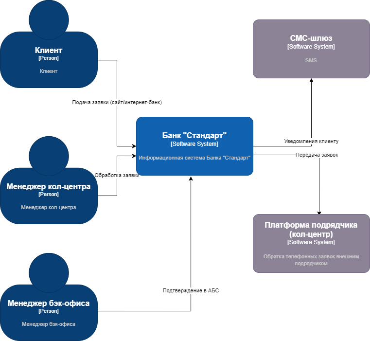
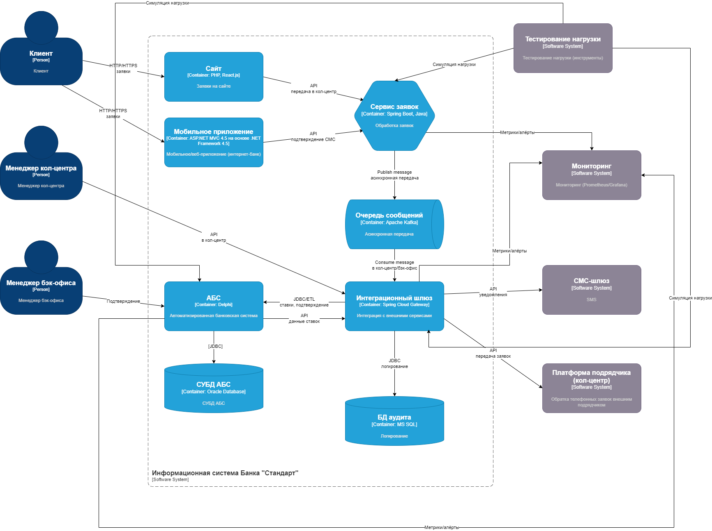

### **Название задачи: Концептуальная архитектура открытия депозитов в MVP цифровой трансформации банка "Стандарт"** 
### **Автор: Акжигитов Р.Р.**
### **Дата: 2025-10-15**
### **Функциональные требования**

|**№**|**Действующие лица или системы**|**Use Case**|**Описание**|
| :-: | :- | :- | :- |
| 1   | Клиент (через сайт) | Подача заявки на депозит через сайт | 1. Клиент заходит на сайт банка. 2. Выбирает депозит из списка с актуальными ставками. 3. Заполняет заявку (ФИО, телефон). 4. Отправляет заявку — система передаёт данные менеджеру кол-центра. 5. Менеджер кол-центра связывается с клиентом для предложения условий. 6. Клиент соглашается — заявка передаётся в бэк-офис. 7. Менеджер бэк-офиса подтверждает в АБС и открывает депозит. 8. Клиент получает СМС-уведомление о завершении.|
| 2   | Клиент (через интернет-банк) | Подача заявки на депозит через интернет-банк | 1. Клиент авторизуется в интернет-банке. 2. Просматривает персонализированные депозиты с ставками. 3. Заполняет заявку (счёт, сумма). 4. Подтверждает заявку через СМС-код. 5. Система автоматически передаёт заявку менеджеру бэк-офиса. 6. Менеджер бэк-офиса подтверждает условия в АБС и открывает депозит. 7. Клиент получает СМС-уведомление о завершении.
| 3   | Менеджер кол-центра (платформа подрядчика) | Обработка заявки из сайта | 1. Система сайта передаёт заявку в кол-центр. 2. Менеджер получает уведомление и данные (ФИО, телефон). 3. Связывается с клиентом, предлагает условия на основе ставок из АБС. 4. Фиксирует согласие клиента и передаёт заявку в бэк-офис. 5. Бэк-офис подтверждает в АБС.
| 4   | Менеджер бэк-офиса (управление депозитами) | Подтверждение и открытие депозита в АБС | 1. Получает заявку из кол-центра или интернет-банка. 2. Проверяет данные в АБС (ставки, счёт клиента). 3. Подтверждает условия и открывает депозит. 4. Инициирует СМС-уведомление через шлюз. 5. Логирует операцию для аудита.
| 5   | АБС (автоматизированная банковская система) | Хранение и обработка данных депозитов | 1. Предоставляет ставки депозитов для отображения в каналах. 2. Принимает подтверждение от бэк-офиса для открытия депозита. 3. Хранит данные клиента и договора. 4. Инициирует СМС через шлюз после открытия.

### **Нефункциональные требования**

|**№**|**Требование**|
| :-: | :- |
| 1	| Доступность сервисов 99.9% и работа 24/7 (Reliability). |
| 2	| Избегать прямого воздействия на АБС (из-за перегрузки БД); использовать асинхронную обработку (Reliability, архитектурно-значимое). |
| 3	| Резервный ЦОД для интернет-банка; горизонтальное масштабирование (Reliability, архитектурно-значимое). |
| 4	| Быстрый отклик операций (миллисекунды); оптимизация загрузки данных (Performance, архитектурно-значимое). |
| 5	| Масштабирование: горизонтальное для интернет-банка, вертикальное для АБС (Performance, архитектурно-значимое). |
| 6	| Шифрование трафика (HTTPS/TLS) для защиты чувствительной информации (Security, архитектурно-значимое). |
| 7	| Интеграция с существующими системами: АБС, кол-центр, СМС-шлюз, Excel (Compatibility, архитектурно-значимое). |
| 8	| Аудит и логирование всех операций (Security/Compliance, архитектурно-значимое). |
| 9	| Тестирование на нагрузку перед запуском (Performance/Reliability, архитектурно-значимое). |
| 10 | Мониторинг и алерты в реальном времени (Supportability, архитектурно-значимое). |
| 11 | Совместимость с технологиями банка (MS SQL, Oracle) (Supportability, архитектурно-значимое). |
| 12 | Максимально удобный интерфейс для клиента (Usability). |

### **Решение**
Приведите диаграммы контекста и контейнеров в модели C4. Опишите там основные компоненты и интеграции всех элементов решения. 

#### Диаграмма контекста (C4 Context Diagram)

[Диаграмма контекста](diagrams/ContextDiagram.drawio)
- **Основные компоненты и интеграции**: Клиент взаимодействует с банком через сайт или интернет-банк. Банк интегрируется с АБС (для ставок и подтверждения), кол-центром (для обработки заявок из сайта), СМС-шлюзом (для уведомлений). Резервный ЦОД обеспечивает 99.9% доступность. Все взаимодействия защищены шифрованием (HTTPS).

#### Диаграмма контейнеров (C4 Container Diagram)

[Диаграмма контейнеров](diagrams/ContainerDiagram.drawio)
- **Основные компоненты и интеграции**: 
  - **Веб-приложение (сайт)**: Фронтенд для заявок, интегрируется с сервисом заявок.
  - **Мобильное/веб-приложение (интернет-банк)**: Существующий канал, расширен для депозитов, с СМС-подтверждением.
  - **Сервис заявок (микросервис)**: Новый микросервис для обработки заявок, масштабируемый горизонтально.
  - **Очередь сообщений (Kafka)**: Асинхронная для защиты АБС от перегрузки.
  - **Интеграционный шлюз**: Шлюз для API-интеграций с АБС, кол-центром, СМС-шлюзом.
  - **АБС (БД)**: Ядро, с ETL для ставок (из Excel на старте).
  - **БД аудита**: Для логирования и compliance.
  - **Мониторинг**: Prometheus/Grafana для 24/7 алёртов.
  - **Тестирование нагрузки**: Инструменты для тестирования нагрузки.
  - Потоки: Клиент → Сервис заявок → Kafka → Шлюз → АБС/Кол-центр → СМС. Масштабирование через кластеры серверов.

**Логика принятия решений и выбора технологий**:
- **Учёт требований**: Функциональные Use Cases требуют интеграций с существующими системами (АБС, кол-центр), поэтому выбрана микросервисная архитектура для модульности (только для депозитов, не затрагивая весь интернет-банк). Надёжность (99.9%) и масштабируемость — горизонтальное для интернет-банка (кластеры), вертикальное для АБС. Производительность — кеширование и индексы в БД. Безопасность — TLS/HTTPS для всех каналов. Совместимость — MS SQL/Oracle для БД, Kafka для очередей (учитывая перспективу). Аудит/логирование — централизованная БД для регуляторных требований (ФНС/ЦБ РФ).
- **Выбор технологий**: Микросервисы (Spring Boot/Java, на базе экспертизы IT-отдела) для сервиса заявок — позволяют изолировать MVP от монолитного интернет-банка. Kafka для асинхронности — защищает АБС от синхронных нагрузок (риск перегрузки). API-гейтвей (например, Spring Cloud Gateway) для шлюза — упрощает интеграции. Мониторинг (Prometheus) — для реального времени, тестирование нагрузки (JMeter) — перед запуском. Резервный ЦОД — для failover. Логика: Минимизировать изменения в существующих системах (АБС как монолит), фокусируясь на новых компонентах для MVP, чтобы снизить риски и стоимость.

### **Альтернативы**
1. **Монолитная архитектура вместо микросервисов**: Вместо отдельного сервиса заявок интегрировать логику напрямую в существующий интернет-банк. Преимущества: Быстрее развернуть, меньше компонентов. Недостатки: Сложнее масштабировать, выше риск влияния на весь банк (не соответствует требованиям масштабируемости и защиты АБС).
2. **Синхронные интеграции вместо асинхронных (без Kafka)**: Прямые API-вызовы к АБС из сервиса заявок. Преимущества: Простота реализации. Недостатки: Риск перегрузки АБС (нарушение требования избегать прямого воздействия), ниже производительность под нагрузкой.
3. **RabbitMQ вместо Kafka**: Альтернативная очередь сообщений. Преимущества: Легче интегрировать с существующими стеками банка. Недостатки: Менее масштабируемая для высоких нагрузок, потенциально выше latency (не оптимально для 99.9% доступности).
4. **Отсутствие резервного ЦОДа**: Полагаться только на основной ЦОД. Преимущества: Снижение затрат. Недостатки: Нарушение требования 99.9% доступности, риски простоев.

**Недостатки, ограничения, риски**
- **Недостатки**: Микросервисная архитектура добавляет сложность (оркестрация сервисов), требует дополнительной экспертизы от IT-отдела (40 чел., заняты АБС/интернет-банком). Интеграция с платформой подрядчика (кол-центр) может быть медленной из-за внешнего поставщика, потенциально замедляя MVP. Асинхронность через Kafka увеличивает latency для подтверждений (не идеально для usability, но необходимо для защиты АБС).
- **Ограничения**: АБС как монолит ограничивает вертикальное масштабирование (требование); Excel в бэк-офисе на старте — ручной ввод ставок, риск ошибок. MVP ограничен депозитами (не затрагивает кредиты), что требует фазового расширения. Совместимость с MS SQL/Oracle — legacy-технологии, менее эффективные для микросервисов (выше overhead).
- **Риски**: Перегрузка АБС при пиковых нагрузках (несмотря на асинхронность, если очередь переполнится) — может привести к простоям, нарушению 99.9%. Безопасность: Риски утечек данных (ФИО, счёта) при интеграциях, требуют строгого compliance (GDPR/ФЗ-152). Зависимость от подрядчика кол-центра — риски задержек или сбоев. Регуляторные риски: Недостаточный аудит/логирование — штрафы от ЦБ РФ. Масштабирование: Горизонтальное требует кластеров, что увеличивает инфраструктурные затраты. Тестирование нагрузки может выявить скрытые проблемы поздно. Мониторинг: Если не настроен правильно, риски незамеченных сбоев. Общий риск: MVP может не интегрироваться бесшовно, приводя к дублированию данных между системами.