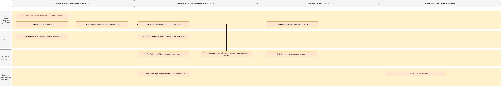

### Список крупных задач для каждой системы из ADR
- **АБС (ядро банка)**: 
  - Добавить API для экспорта ставок (разработка и тестирование) — 20 чел.-дней (IT-команда).
  - Настроить ручной ввод ставок из Excel — 5 чел.-дней (бэк-офис).
- **Сервис ставок (новый микросервис)**: 
  - Разработать микросервис для экспорта и кеширования ставок — 30 чел.-дней (IT-команда).
  - Интегрировать с АБС и БД кеша — 15 чел.-дней (IT-команда).

- **БД ставок (кеш)**: 
  - Настроить кеш (MS SQL) для хранения ставок — 10 чел.-дней (IT-команда).

- **SFTP-сервер**: 
  - Настроить сервер для генерации и передачи файлов партнёру — 15 чел.-дней (IT-команда).
  - Обеспечить шифрование и аудит — 10 чел.-дней (IT-команда).

- **Интеграционный шлюз**: 
  - Добавить API для синхронизации ставок с собственным кол-центром — 20 чел.-дней (IT-команда).

- **Платформа подрядчика (собственный кол-центр)**: 
  - Интегрировать отображение ставок в интерфейсе менеджеров — 25 чел.-дней (IT-команда, с подрядчиком).

- **Партнёрский кол-центр**: 
  - Согласовать процесс загрузки файлов и тестирование — 10 чел.-дней (трансформация, с партнёром).

- **Мониторинг (Prometheus/Grafana)**: 
  - Настроить алёрты для синхронизации — 10 чел.-дней (IT-команда).

- **Общие (тестирование и безопасность)**: 
  - Тестирование передачи файлов и нагрузки — 20 чел.-дней (IT-команда).
  - Аудит и compliance (логирование) — 15 чел.-дней (трансформация).

### RoadMap

[RoadMap](diagrams/RoadMap.drawio)