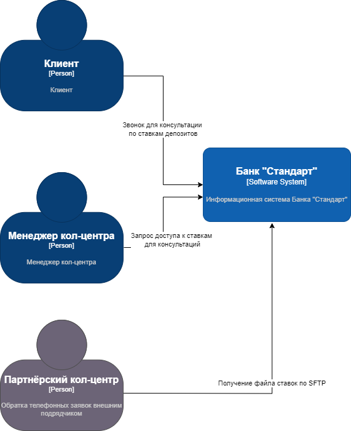
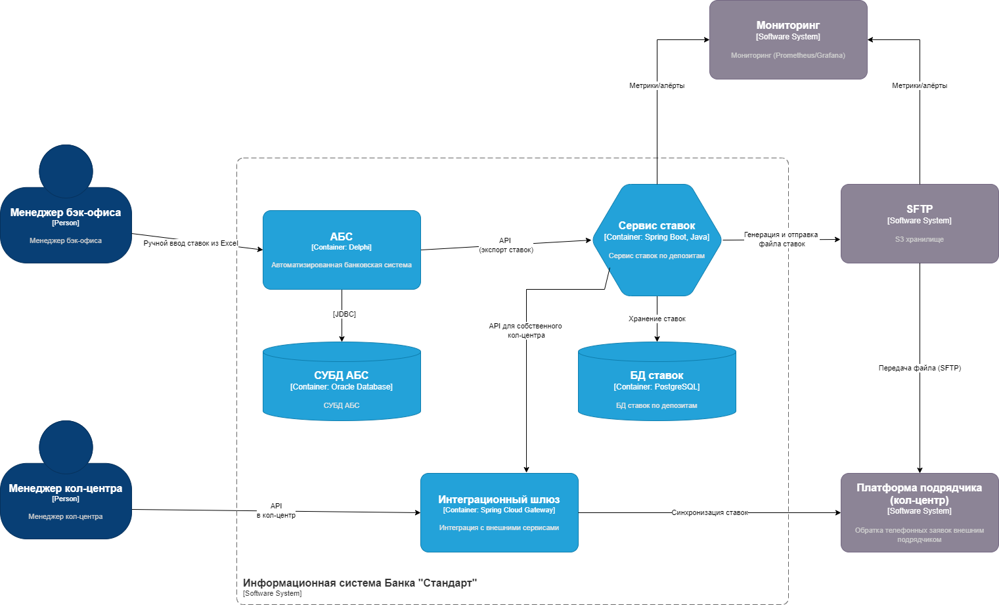

### **Название задачи: Интеграция доступа к ставкам депозитов для консультаций в кол-центрах (собственный и партнёрский) в MVP цифровой трансформации банка "Стандарт"** 
### **Автор: Акжигитов Р.Р.**
### **Дата: 2025-10-18**
### **Функциональные требования**
|**№**|**Действующие лица или системы**|**Use Case**|**Описание**|
| :-: | :- | :- | :- |
|1|Клиент (пожилой, звонит в кол-центр)|Консультация по ставкам депозитов в собственном кол-центре|1. Клиент звонит в кол-центр банка для уточнения условий депозита (после маркетинговой кампании). 2. Менеджер кол-центра получает доступ к актуальным ставкам из АБС через интеграцию. 3. Менеджер консультирует клиента по ставкам и предлагает подать заявку. 4. Если клиент соглашается, процесс переходит к открытию депозита (как в базовом MVP).|
|2|Менеджер кол-центра (собственный)|Доступ к ставкам для консультаций|1. Менеджер авторизуется в платформе подрядчика. 2. Система запрашивает актуальные ставки из АБС через интеграционный шлюз. 3. Ставки отображаются в интерфейсе менеджера. 4. Менеджер использует их для ответа на вопросы клиента.|
|3|Партнёрский кол-центр (внешняя система)|Получение и использование ставок для консультаций|1. Банк генерирует файл с актуальными ставками из АБС. 2. Файл передаётся партнёрскому кол-центру по SFTP. 3. Партнёрский менеджер загружает файл в свою систему и консультирует клиентов по ставкам. 4. Процесс консультации аналогичен собственному кол-центру, но без прямой интеграции с АБС.|
|4|Бэк-офис (менеджер)|Обновление ставок в АБС (ручной процесс)|1. Менеджер бэк-офиса получает ставки из Excel (на старте MVP). 2. Вводит их в АБС. 3. АБС предоставляет ставки для экспорта в файлы или API-доступа кол-центрам.|

### **Нефункциональные требования**
|**№**|**Требование**|
| :-: | :- |
|1|Доступность ставок 99.9% для кол-центров (Reliability, архитектурно-значимое).|
|2|Автоматическая синхронизация ставок из АБС в кол-центры (Compatibility, архитектурно-значимое).|
|3|Безопасная передача файлов ставок по SFTP (шифрование, аутентификация) (Security, архитектурно-значимое).|
|4|Масштабируемость: Поддержка партнёрского кол-центра без перегрузки АБС (Performance, архитектурно-значимое).|
|5|Обновление ставок в реальном времени или ежедневно (для точности консультаций) (Performance).|
|6|Совместимость с SFTP (для партнёра) и API (для собственного кол-центра) (Compatibility, архитектурно-значимое).|
|7|Аудит передачи ставок (логирование SFTP-сессий) (Security/Compliance, архитектурно-значимое).|
|8|Мониторинг нагрузки на кол-центры и АБС (Supportability, архитектурно-значимое).|
|9|Удобство для пожилых клиентов: Простые консультации без сложных интерфейсов (Usability).|
|10|Тестирование передачи файлов и синхронизации перед запуском (Reliability, архитектурно-значимое).|

### **Решение**
#### Диаграмма контекста (C4 Context Diagram)

[Диаграмма контекста](diagrams/ContextDiagram.drawio)
- **Основные компоненты и интеграции**: Клиент звонит для консультаций. Собственный кол-центр получает ставки через шлюз из АБС. Партнёрский кол-центр получает файл по SFTP для автономной работы. АБС — источник данных. SFTP обеспечивает безопасную передачу без API.

#### Диаграмма контейнеров (C4 Container Diagram)

[Диаграмма контейнеров](diagrams/ContainerDiagram.drawio)
- **Основные компоненты и интеграции**: 
  - **Сервис ставок (новый микросервис)**: Экспортирует ставки из АБС, генерирует файлы для SFTP, синхронизирует с шлюзом.
  - **БД ставок (кеш)**: Кеш для быстрого доступа, обновляется из АБС.
  - **SFTP-сервер**: Для безопасной передачи файлов партнёру.
  - **Интеграционный шлюз**: Обеспечивает API-доступ для собственного кол-центра.
  - Потоки: АБС → Сервис ставок → Шлюз (собственный) или SFTP (партнёр). Ручной ввод из Excel для старта.

**Логика принятия решений и выбора технологий**:
- **Учёт требований**: Функциональные Use Cases требуют консультаций без перегрузки АБС, поэтому кеш ставок и асинхронная синхронизация. Надёжность (99.9%) — мониторинг и тестирование. Безопасность — SFTP с шифрованием. Совместимость — SFTP для партнёра (как указано), API для собственного. Масштабируемость — микросервис для ставок, чтобы не затрагивать весь MVP. Удобство для пожилых — простые консультации через телефон.
- **Выбор технологий**: Микросервис (Spring Boot) для сервиса ставок — модульный, интегрируется с АБС. SFTP-сервер (например, Apache Mina) — стандарт для файлов, безопасный. Кеш (Redis или MS SQL) — для производительности. Логика: Минимизировать изменения в АБС (ручной ввод из Excel), фокус на новых компонентах для быстрого MVP, снижая риски для пожилых клиентов (быстрые консультации снижают звонки).

### **Альтернативы**
1. **API-доступ для партнёрского кол-центра вместо SFTP**: Прямые вызовы к сервису ставок. Преимущества: Реальное время, меньше задержек. Недостатки: Партнёр не поддерживает API, нарушает требования совместимости.
2. **Ручная передача файлов вместо автоматизации**: Менеджер бэк-офиса отправляет файл вручную. Преимущества: Простота, низкие затраты. Недостатки: Риск ошибок, задержки, не соответствует требованиям реального времени и масштабируемости.
3. **Общий кеш ставок без микросервиса**: Интегрировать кеш напрямую в АБС. Преимущества: Меньше компонентов. Недостатки: Перегрузка АБС, нарушение защиты от прямого воздействия.
4. **Отсутствие партнёрского кол-центра**: Расширить собственный. Преимущества: Простота интеграции. Недостатки: Риск перегрузки, не решает проблему с пожилыми клиентами.

### Недостатки, ограничения, риски
- **Недостатки**: SFTP добавляет задержки (ежедневные обновления вместо реального времени), что может снизить точность консультаций. Ручной ввод из Excel — источник ошибок в ставках.
- **Ограничения**: Партнёр не поддерживает API, ограничивая автоматизацию. АБС как монолит ограничивает вертикальное масштабирование кеша.
- **Риски**: Перегрузка АБС при экспорте ставок (несмотря на кеш). Безопасность SFTP: Риски утечек файлов. Зависимость от партнёра — сбои в передаче. Регуляторные риски: Неправильные ставки — жалобы от клиентов. Мониторинг: Если не настроен, риски незамеченных сбоев синхронизации.
